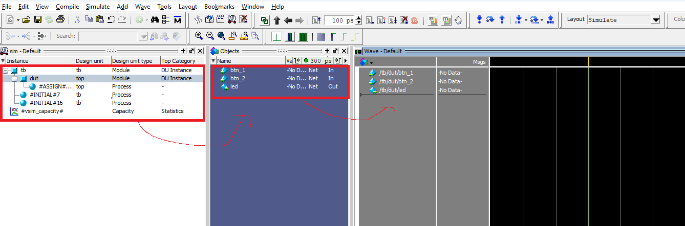
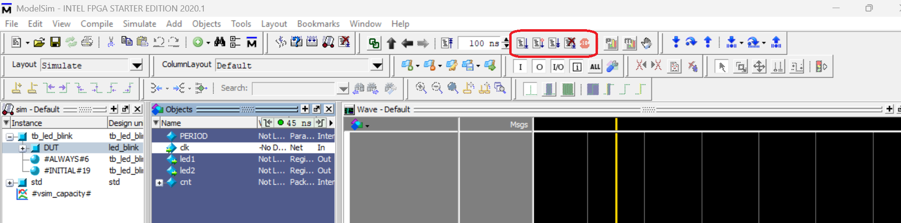
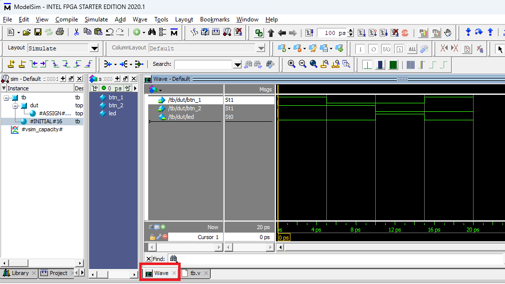
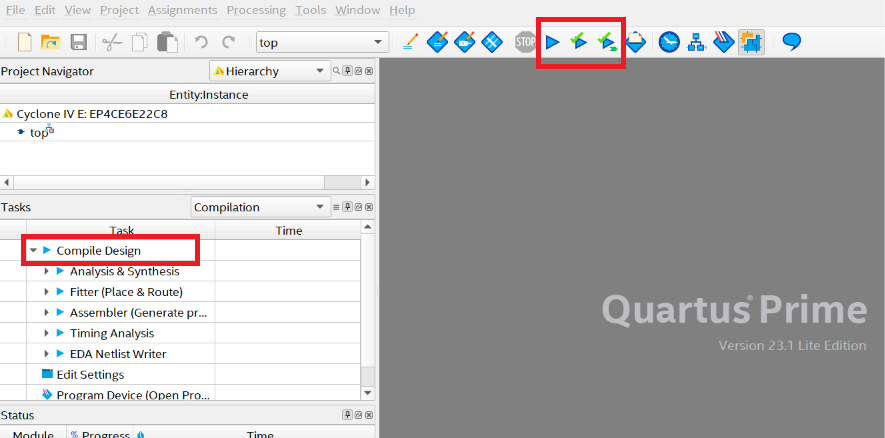
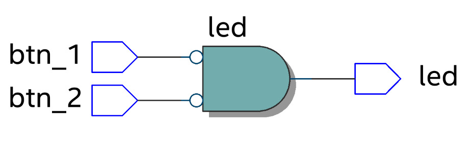
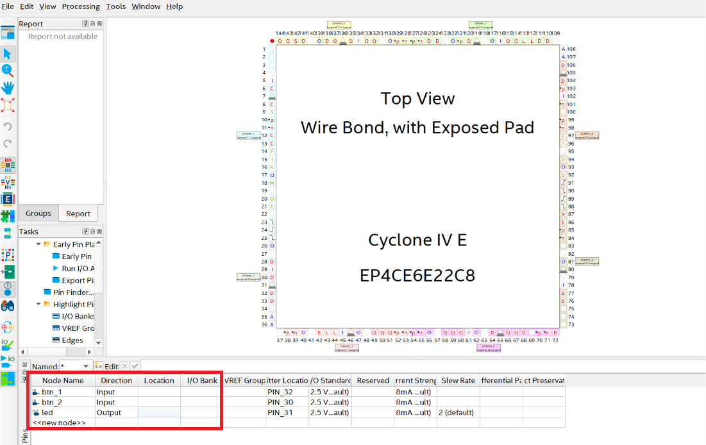
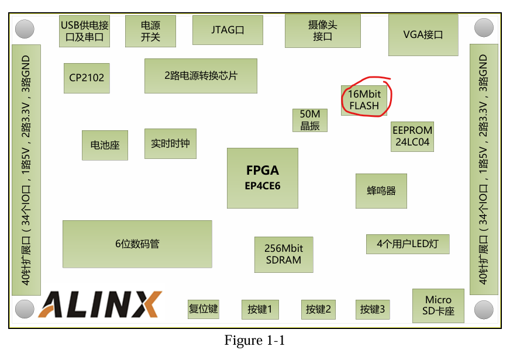
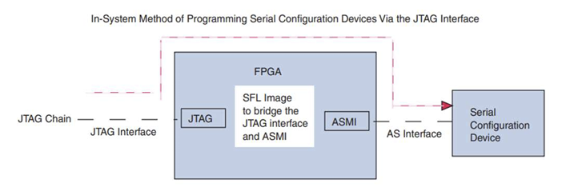
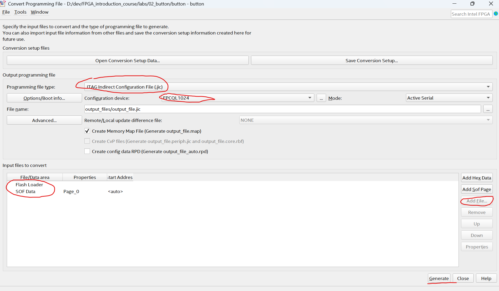
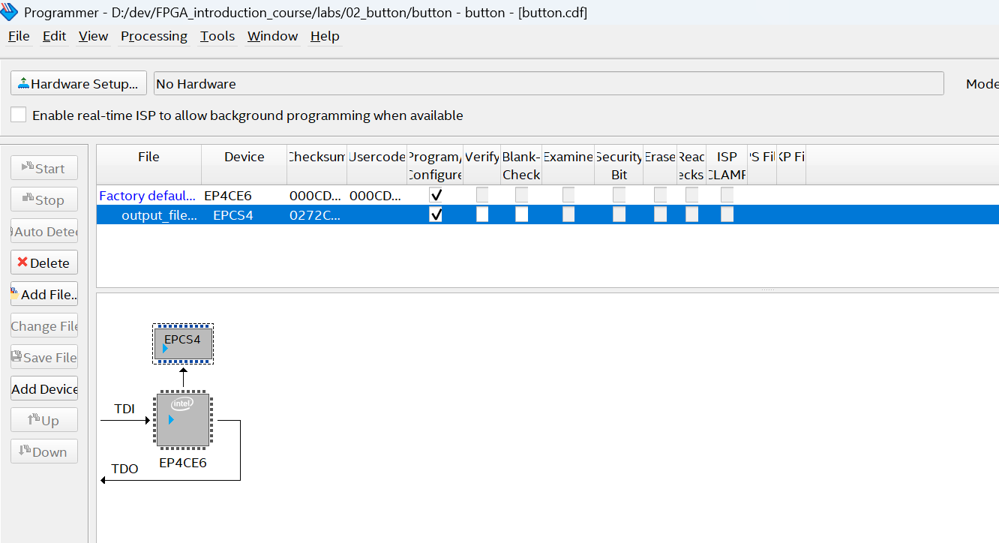

# Простейший проект моргающего диода

## Симуляция в ModelSim (можно использовать любой альтернативный симулятор)

* Создаем новый проект File -> New Project (выберите examples/01_workflow в качестве директории проекта).
* Заполните имя проекта.
* Добавьте файлы проекта (Add Existing File [top.v, tb.sv])
* Перед симуляцией файлы необходимо скомпилировать Compile->Compile All. Если при разработке вы будете менять какие то файлы, то их можно перекомпилировать отдельно.
* Запустите симуляцию: 
    * Simulate->Start simulation
    * выберите модуль тестбенча (work->tb)
* Добавьте все необходимые сигналы в панель Wave (пример с добавлением clk)

* Запустите симуляцию. После запуска симуляции выйдет окно "Хотите ли закончить симуляцию", отвечайте нет (иначе окно с симуляцией просто закроется полностью).  

* Далее выберите снизу вкладку Wave чтобы открыть временную диаграммму.

## Проект в Quartus

### Создание проекта
* New Project Wizard
* Directory, Name, Top-Level Entity
    * Directory: выберите examples/01_workflow в качестве директории проекта.
    * Project Name: название для проекта.
    * Top-Level Entity: top.
*  Project Type
    *  Empty project
*  Add Files
    *  Добавьте файл top.v (tb.v используется только для симуляции)
*  Device
    *  Выберите свое устройство. Свою модель можно посмотреть на чипе (либо EP4CE6E22C8 либо EP4CE6F17I7). Также Device можно выбрать позже из меню Assignments->Device...
*  Далее Next до конца.
### Синтез проекта
* Запустите Синтез 

* После синтеза можно будет посмотреть отчеты и ошибки/предупреждения.
### RTL Viewer
После синтеза можно посмотреть в какую схему преобразовался ваш код. Для этого надо зайти в Tools->Netlist Viewer->RTL Viewer. 

### Pin assignment
Необходимо ассоциировать порты (входы/выходы) модуля верхнего уровня (Top level entity) с физическими пинами чипа.  
Для этого необходимо знать разводку платы. Для этого нужна документация на плату.  
Для чипа EP4CE6E22C8 - [schematic](../../docs/schematic_v200.pdf) и [документ на борду](../../docs/3-EASY%20FPGA%20Development%20Board%20Users%20Manual.pdf).  
Для чипа EP4CE6F17I7 - [User manual](../../docs/AX301_English_ug_V1.0.pdf).  
* Откройте окно Pin Planer (Assignments->Pin Planer). Там на нижней панели вы должны увидеть список портов топ модуля (список будет пуст если вы не запускали синтез и его можно заполнить впустую, но проще запустить синтез после которого они появятся).
* Добавьте ассоциации для входов/выходов модуля led_blink (Найдите в документации почему были выбраны именно эти пины).
  * btn_1
    * Node Name: btn_1
    * Location EP4CE6E22C8 - PIN_90  / EP4CE6F17I7 - PIN_M15
    * I/O Standard: 3.3-V LVTTL
  * btn_2
    * Node Name: btn_2
    * Location EP4CE6E22C8 - PIN_91 / EP4CE6F17I7 - PIN_M16
    * I/O Standard: 3.3-V LVTTL
  * led
    * Node Name: led
    * Location: EP4CE6E22C8 - PIN_2 / EP4CE6F17I7 - PIN_E10
    * I/O Standard: 2.5 V

чуть больше о pin planner можно почитать [тут](https://robotclass.ru/articles/fpga-quartus-pin-planner/) или обо всех возможностя в документации на чип [тут](../../docs/cyclone4-handbook.pdf)

### Program device
Скомпилируйте проект

Прошейте устройство.
* Подключите питание платы. (так же на плате есть switch для питания. Передвиньте его в положение ON).
* Подключите JTAG.
* Откройте окно Program Device
* Если программатор не был выбран автоматически, выберите его
* Прошейте устройство
* Вы должны увидеть как 2 диода поочередно мигают  

### Program Flash memory
При использовании метода выше, прошивка (.sof (SRAM Object File) файл, сгенерированный  при синтезе) загружается в конфигурационную SRAM память на чипе FPGA. Данная память энергозависима и поэтому при отключении питания прошивка сотрется.  
При включении питания FPGA подгружает прошивку из Flash памяти, подключенной к определенным пинам.  

Для того, чтобы прошить память, надо будет знать ее модель, которую можно посмотреть в документации или лучше прочитать прям на чипе (иногда может не совпадать с документацией, к сожалению).  
Во многих бордах, особенно дешевых, напрямую прошить флеш память не получится. Т.к. JTAG нельзя подключить напрямую к памяти. В таком случае используется следующая схема. В FPGA загружается специальная прошивка, называемая SFL (Serial Flash Loader). Данная прошивка выступает мостом между ножками FPGA, к которым подключен JTAG и ножками FPGA, к которым подключена FLASH память. Потом через данный мост загружается прошивка во FLASH память.

Приступим непосредственно к программированию FLASH памяти. При синтезе генерируется .sof файл, который представляет собой конфигурацию SRAM для FPGA. Для того, чтобы прошить FLASH память описанным выше методом, нам для начала потребуется сгенерировать .jic (JTAG Indirect Configuration) файл, который будет содержать конфигурацию FPGA (из .sof) и SFL. Для его генерации:
* Зайдите в File -> Convert Programming Files
* Установите Programming file type в JTAG Indirect Configuration
* В Configuration Device укажите ваш чип памяти
* в Input files to convert добавьте .sof файл (результат синтеза из папки output_files). Выделите SOF Data и нажмите Add File...
* В Input files добавьте SFL образ. В таблице выделите Flash Loader и справа нажмите Add Device (выберите свою модель чипа).
* Нажмите Generate

После того, как файл сгенерирован, осталось прошить
* Зайдите в меню Program Device (как и при обычной прошивке)
* через Add File... добавьте сгенерированный .jic файл
* удалите строчку с предыдущей пршивкой
* в поле Programm/Configure установите галочку
* результат должен выглядеть как на картинке
* нажмите start (прошивка будет длиться дольше чем при прошивке напрямую FPGA)
* после окончания прошивки, выключите и включите питание
* теперь ваша прошивка будет загружаться после подачи питания.

