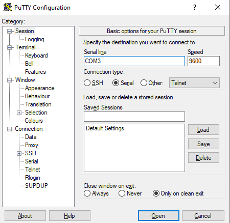
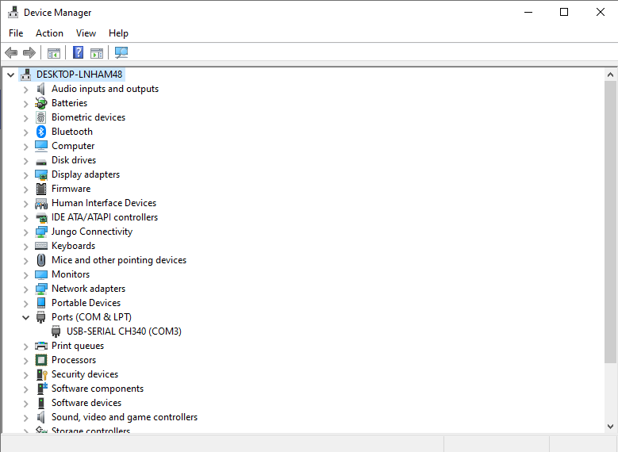

# Пример: UART Transmitter
Цель: по нажатию кнопки отправить в терминал сообщение

* button: обработка нажатия кнопки
* uart_tx: передача байта данных по запросу
* top: модуль верхнего уровня. С помощью button получает сигнал на отправку и управляет модулем uart_tx для последовательной отправки всех байтов сообщения.

## Порядок работы
* Запустите симуляцию и разберитесь в работе приемника. 
    - tb_uart_tx.sv - симуляция модуля uart_tx отдельно.
    - tb_top.sv - симуляция всего устройства.
* Синтезируйте устройство (top.v). Не забудьте про правильное назначение пинов и .sdc ограничения.
    - Warning! Будьте осторожны и не перепутайте пины TX и RX (периодически на схеме путают TX/RX какого именно устройства обозначен на схеме FPGA или USB-UART преобразователя).
* Прошейте устройство и подключите его через COM порт.
* При нажатии на кнопку (которую вы назначили в pin planner) в терминале должна появиться надпись Hello.

## Подключение через Putty

На windows для приема можно использовать PuTTY. Надо выбрать serial и указать COM порт.  
  
Узнать к какому COM порту следует подключиться можно в диспетчере устройств. Зайдите в диспетчер устройств и подразделом Ports (COM & LPT) найдите свое устройство.   
  
Если FPGA подключена, но устройство в данном разделе отсутствует, то установите драйвера. [(Драйвера для USB-UART преобразователя указанного в мануале на плату)](https://robotchip.ru/ustanovka-drayvera-pl-2303hx-na-windows-8-10/?ysclid=m2qi279ebx900245343).После прошивки платы и открытия порта, в нем должно печататься сообщение отправляемое FPGA.